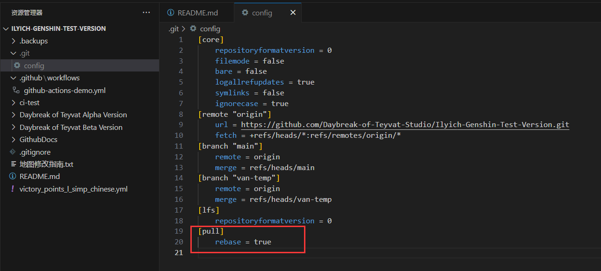
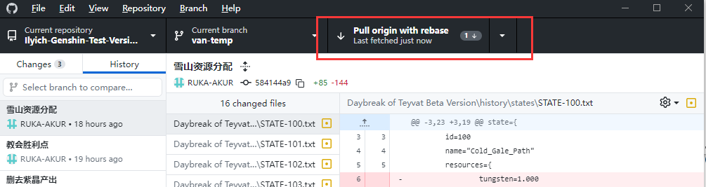
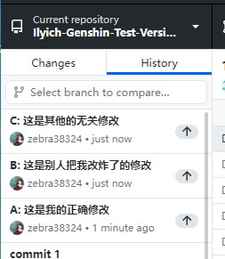

# 变更代码合并方式
## 为什么要变更？原来的方式有何问题？
1. 一直以来大家都对"Merge branch 'main'"这种`merge commit`充满疑惑。看起来这个commit挂了自己的名字，但内容都不是自己修改的。
2. 在多人高强度同时修改代码时，原来的merge方式会让历史记录十分混乱，无法清晰知晓修改顺序。**在出现代码不小心被其他人改错的情况时，多个commit和merge信息杂糅在一次，可能很难通过revert修改直接恢复，让人十分痛苦。**

## 如何变更？
1. 将原有的"merge"变更方式转变为"rebase"。具体原理可以不用太在意。如果感兴趣可以看看[这里](https://juejin.cn/post/6844903951679094798)或者百度一下。
2. 之后将会对主分支进行限制，当本地的新修改中含有`merge commit`时，就会被禁止`push`到github上

## 变更之后有什么好处？
1. 以后历史记录里不会再出现让人讨厌的`merge commit`
2. 让所有的修改都是线性的。换句话说，后push的人，他的修改一定排在历史纪录的最新位置。

## 我们需要做什么
1. 尽可能减小大家的学习成本，在本地只需要修改一个地方
   
   在本地仓库根目录下打开.git/config文件（.git是隐藏文件夹，需要显示隐藏文件夹才能看到），在末尾添加：
   ```
   [pull]
      rebase = true
   ```
   最终文件大概长这样子：
   
2. 按上面添加完之后，github desktop的`pull origin`将会自动变成`pull origin with rebase`，大家可以按照之前的工作方式进行使用，没有什么区别。（**当然还是建议及时上传更新自己的修改。小步快跑，而不是攒一波大的**）
   


## 以后代码被别人改错了怎么处理
由于修改都是线性的，只需要从你的修改往后找，找到错误的修改，revert掉即可。

这里举一个例子，有三个修改，从旧到新分别是A、B、C。其中B修改是错误的，将B修改revert掉，让其提交人重新检查后再去修改即可。

如果显示revert冲突，那意味着C修改和B修改变更了同一块代码，那么出于临时规避问题的考虑，可以由新到旧的顺序，依次revert。即也revert C，再revert B。


